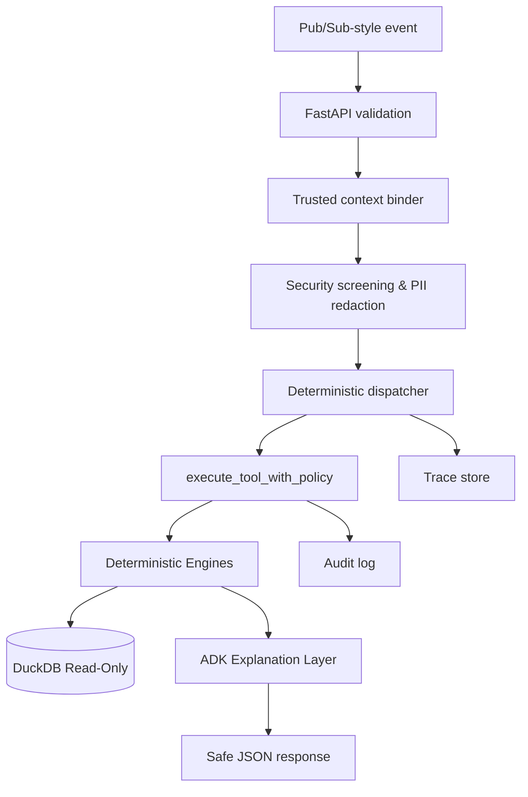

# CashFlow Guardian

CashFlow Guardian is an SME cash-flow early warning and decision-support system. It combines read-only financial data access, deterministic feature construction, risk scoring, peer benchmarking, scenario simulation, draft intervention recommendations, policy controls, HITL boundaries, audit logging, and trace capture.

## 1. Project Overview
CashFlow Guardian is designed to monitor cash-flow health for Small and Medium Enterprises (SMEs). It connects a secure, deterministic data and risk engine with an AI-agentic explanation layer using the Google ADK. The system provides automated early-warning alerts, risk explanations, scenario simulations, and intervention drafts while strictly guarding data integrity and security boundaries.

## 2. Problem Statement
SMEs often face sudden liquidity crises due to delayed payments, seasonal variations, or unexpected cost increases. While traditional accounting tools capture historical data, they lack foresight. Building an automated system that analyzes risk is challenging because models (LLMs) are prone to hallucinations, cannot reliably compute financial metrics, and present security risks (like prompt injections or unauthorized actions).

## 3. Why an Agentic System
An agentic system bridges the gap between complex financial analysis and business users. Rather than forcing users to navigate complex query builders or static dashboards, an agent can dynamically interpret user intents (e.g. "Simulate a revenue drop"), select the correct deterministic tools, call them in order, format the outputs, and explain the mathematical results in natural language.

## 4. Key Features
- **Deterministic Risk Scoring**: Generates reliable cash-flow risk metrics based on verified database queries.
- **Stress-Test Scenario Simulation**: Runs hypothetical calculations (e.g. revenue drops or payment delays) to project liquidity impact.
- **Model-Safe Security Sandbox**: Exposes only read-only or draft-generating tools to the AI agent.
- **Human-in-the-Loop (HITL) Controls**: Watchlist actions and intervention executions cannot be authorized by the model and must go through human approval.
- **PII & Data Redaction**: Automatically filters out sensitive personal and financial identifiers before sending outputs.
- **Agents CLI Integration**: Provides a structured command-line interface for local agent execution.

## 5. Architecture
The system segregates untrusted inputs, AI logic, policy gates, and deterministic databases:



## 6. Deterministic Engines
All mathematical and financial calculations are performed by deterministic Python engines located in `src/cashflow_guardian/`:
- `data_engine`: Connects to DuckDB to perform point-in-time checks, health tests, and query portfolio status.
- `risk_engine`: Computes stress-test scores based on structured rules.
- `benchmark_engine`: Places businesses within historical peer benchmark percentiles.
- `scenario_engine`: Performs stress simulations.
- `intervention_engine`: Drafts potential resolution strategies.

## 7. Google ADK Role
The Google ADK (Agent Development Kit) acts purely as an orchestrator and translator. The model does not perform financial math or direct database mutations. Instead, the ADK reads the output of deterministic tools and translates them into readable narrative summaries, reports, or explanations for end users.

## 8. Model-Safe Tools
The agent is restricted to an allowlist of model-safe tools:
- `check_business_data_quality`
- `get_portfolio_snapshot`
- `get_business_history`
- `score_cashflow_risk`
- `compare_with_peers`
- `simulate_cashflow_scenario`
- `draft_intervention_plan`

These tools route through `execute_tool_with_policy()`. The model cannot directly call underlying engines.

## 9. SecurityContext and Policy Enforcement
Every tool execution is gated by a `SecurityContext` containing:
- `role`: e.g. `analyst`, `risk_manager`, `admin`
- `user_id`: Identifier of the requester
- `session_id`: Session token to prevent cross-session memory leaks

The policy engine (`src/cashflow_guardian/policy/engine.py`) enforces Role-Based Access Control (RBAC). If a model attempts to run a tool without correct permissions, or attempts to supply a mocked role, the policy engine rejects the execution.

## 10. Human-in-the-Loop Controls
Critical operations—specifically proposing or approving watchlist actions and executing interventions—are classified as privileged and are completely excluded from the model-safe tool allowlist. The AI agent can draft intervention plans (`draft_intervention_plan`), but these are flagged with a `draft_requires_review` status and cannot be finalized without manual human approval.

## 11. FastAPI Ambient Endpoint
The application exposes a local FastAPI service in `app/adk_app.py` running on port 8080. It validates inbound push events and processes them through the deterministic dispatcher.

## 12. Supported Event Types
The FastAPI ambient service processes the following push event types:
- `portfolio_snapshot`: Queries the portfolio health.
- `analyze_company`: Audits a specific business.
- `benchmark_company`: Benchmarks against peers.
- `simulate_scenario`: Evaluates stress situations.
- `draft_intervention`: Recommends safety strategies.

## 13. Local Installation
Verify that you have Python >=3.10 and `uv` installed.
```powershell
uv sync
uv pip install -e .
```

## 14. Environment Variables
Copy `.env.example` to `.env` and configure your local settings:
- `GEMINI_API_KEY`: Required for local Gemini inference.
- `CASHFLOW_GUARDIAN_ENV`: Set to `local`.
- `CASHFLOW_GUARDIAN_LOG_LEVEL`: Set to `info`.

## 15. Running Tests
Run all unit and integration tests using `pytest`:
```powershell
uv run pytest
```

## 16. Running the Local Server
Start the Uvicorn FastAPI server:
```powershell
uv run python -m uvicorn app.adk_app:app --host 0.0.0.0 --port 8080
```

## 17. Agents CLI Usage
Verify that the `agents-cli` recognizes our adapter:
```powershell
agents-cli info
```
Run a query using the command-line interface:
```powershell
agents-cli run "Summarize CashFlow Guardian capabilities"
```

## 18. Evaluation Results
- **Smoke Evaluation (Step 9A)**: Completed successfully for 2 smoke cases. The generated traces verified correct tool-routing (e.g. to `get_portfolio_snapshot`) and proper prompt injection containment.
- **Deterministic Check**: The checker successfully validated the smoke traces, achieving a 100% pass rate.
- **Full Dataset**: A full 16-case dataset (`cashflow_guardian_dataset.json`) and expectations file have been fully prepared.

## 19. Security Evidence
- **Unchanged Data State**: Verify that DuckDB and `demo_actions.json` are completely unmodified by read-only queries.
- **PII Redaction**: Unit tests verify that any raw email or phone numbers are masked or refused.
- **Prompt Injection Containment**: Confirmed that prompt injections attempting to bypass policies are safely refused.

## 20. Limitations
- **Cloud Deployment**: Live deployment to Google Cloud Run, cloud Pub/Sub, or production identity systems was not completed.
- **Full Dataset Trace Generation**: `agents-cli eval generate` was not run for the full dataset because it requires a GCP project and ADC configuration.
- **Metric Grading**: `agents-cli eval grade` requires Vertex AI Evaluation Service to run, which was bypassed due to environment constraints.

## 21. Repository Structure
- `src/`: Core Python modules (engines, policy, security, tools).
- `app/`: FastAPI application endpoints.
- `agents_cli_agent/`: Agents CLI adapter package.
- `tests/`: Unit and integration tests.
- `docs/`: Design docs, failure analyses, demo scripts, and evidence.
- `artifacts/`: Generated smoke traces and logs.

## 22. Future Work
- Establish secure GCP project binding for automated Vertex AI evaluation pipelines.
- Implement production-grade persistent sessions.
- Deploy to Cloud Run with full Pub/Sub integration.
