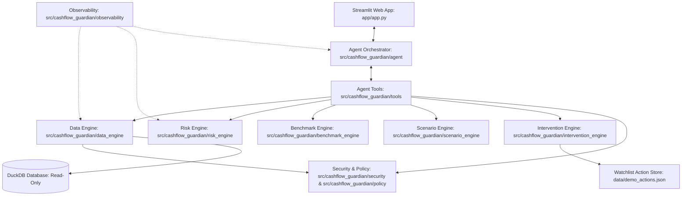

# System Architecture & Technical Specifications

This document defines the system architecture, component layout, and data-flow specifications for the **CashFlow Guardian** system. All package imports and logic are organized under the unified `src/cashflow_guardian/` directory.

---

## 1. System Architecture Overview

The system is split into three main layers: Presentation/UI, Agentic Orchestration, and the Core Engines. The database remains strictly read-only, and any HITL actions write to a local JSON file.



---

## 2. Agent Workflow & Routing

The Agent Orchestrator parses user prompts, routes the request to appropriate tools in a loop, and synthesizes the outputs.

```mermaid
sequenceDiagram
    autonumber
    actor User as Relationship Manager (RM)
    participant Agent as Agent Orchestrator
    participant Tool as Agent Tools
    participant Engine as Core Engines (Python/SQL)
    participant ActionStore as Demo Action Store (JSON)

    User->>Agent: User input prompt (e.g., "Analyze Acme Corp's stress")
    Note over Agent: Validates input length & check for injections
    Agent->>Agent: Route intent & select tools
    
    rect rgb(30, 40, 50)
        Note over Agent, Engine: Tool Execution Loop
        Agent->>Tool: Execute check_business_data_quality(business_id, month)
        Tool->>Engine: Run checks & retrieve metadata
        Engine-->>Tool: Return DataQualityResult & Provenance
        Tool-->>Agent: Return structured JSON
        
        Agent->>Tool: Execute score_cashflow_risk(business_id, month)
        Tool->>Engine: Load model & compute features
        Engine-->>Tool: Return RiskScore & feature contributions
        Tool-->>Agent: Return structured JSON
    end

    Agent->>Agent: Synthesize facts & draft intervention recommendations
    Agent-->>User: Return structured markdown response

    opt Watchlist Action Proposal (HITL Flow)
        User->>Agent: "Add Acme Corp to watchlist"
        Agent->>Tool: Execute propose_watchlist_action(business_id, month)
        Tool->>ActionStore: Write entry as "pending"
        ActionStore-->>Tool: Success
        Tool-->>Agent: Proposal Drafted & Pending Approval
        Agent-->>User: Render "Approve Watchlist Add" UI Button
        
        User->>UI: Clicks "Approve" button
        UI->>Tool: Execute approve_or_reject_watchlist_action(action_id, "approved")
        Tool->>ActionStore: Update entry to "approved"
        ActionStore-->>Tool: Success
        Tool-->>UI: Return updated status
        UI-->>User: Watchlist Updated (Prisinte DB remains untouched)
    end
```



---

## 3. Component Directory Structure & Responsibilities

All modules are structured under `src/cashflow_guardian/`:

| Module Path | Responsibility | Allowed Database Tables |
| :--- | :--- | :--- |
| **`src/cashflow_guardian/data_engine`** | Connects to DuckDB, runs schema/data quality audits, extracts point-in-time metrics, and structures wide feature datasets. | All DuckDB tables (Read-Only) |
| **`src/cashflow_guardian/risk_engine`** | Loads serialized model weights (Logistic Regression baseline or tree-based candidate), validates inputs, predicts cash stress, and determines feature contributions. | `business_monthly_snapshots`, model weights |
| **`src/cashflow_guardian/benchmark_engine`**| Matches businesses to peer groups (by industry/region/revenue) and evaluates deviation from benchmark margins and volatility. | `industry_benchmark`, `region_dim` |
| **`src/cashflow_guardian/scenario_engine`** | Evaluates deterministic what-if cash-flow scenarios using user-supplied shock parameters (no LLM math allowed). | `business_monthly_snapshots` |
| **`src/cashflow_guardian/intervention_engine`** | Maps risks to specific intervention plans and manages the proposed action workflow. Writes to `data/demo_actions.json`. | None (DuckDB), writes only to `data/demo_actions.json` |
| **`src/cashflow_guardian/agent`** | Handles prompt templates, LLM client connections, routing logic, and natural language synthesis. | None |
| **`src/cashflow_guardian/tools`** | Implements the schema-enforced, parameterized tool functions exposed to the Agent. | Managed by individual engines |
| **`src/cashflow_guardian/policy`** | Houses eligibility rules, limits, RAG thresholds, and authorization gates. | None |
| **`src/cashflow_guardian/security`** | Enforces input cleansing, transaction memo parsing constraints, prompt-injection defenses, and data masking. | None |
| **`src/cashflow_guardian/observability`** | Records traces: route taken, tools called, runtimes, validation errors, and token consumption. | None |
| **`src/cashflow_guardian/reporting`** | Formats findings into markdown summaries and structured metrics for dashboard rendering. | None |
| **`src/cashflow_guardian/mcp`** | Implements MCP protocol endpoints to expose tools and schemas to external clients. | None |

---

## 4. Division of Responsibilities: Deterministic Code vs. LLM

To ensure system reliability, a strict separation of computational and reasoning tasks is maintained:

| Task / Operation | Responsible System Component | LLM Involvement |
| :--- | :--- | :---: |
| **Parsing user intent** | `src/cashflow_guardian/agent` | **Yes** (Identifies routing and extracts parameters) |
| **Database Queries & Joins** | `src/cashflow_guardian/data_engine` (DuckDB via SQL templates) | **No** (Strictly forbidden from writing or altering SQL) |
| **RAG Threshold Classifications** | `src/cashflow_guardian/policy` (Provisional defaults in config) | **No** (Evaluated deterministically in Python) |
| **Downside Multiplier Math** | `src/cashflow_guardian/scenario_engine` (Deterministic Python arithmetic) | **No** (LLM is prohibited from calculating new values) |
| **Predictive Probability Scoring** | `src/cashflow_guardian/risk_engine` (Logistic Regression / XGBoost) | **No** (Loaded model handles calculations) |
| **Formatting final responses** | `src/cashflow_guardian/agent` | **Yes** (Synthesizes facts and presents them in markdown) |
| **Writing to Demo Watchlist** | `src/cashflow_guardian/intervention_engine` (Saves JSON audit log) | **No** (Executed by UI triggers after HITL approval) |

---

## 5. Point-in-Time Data Flow & Provenance

### 5.1 Point-in-Time Guarantee
To avoid lookahead bias, all data extraction and model execution must implement temporal filters:
* A request with `as_of_month = YYYY-MM` compiles features using transactions where `transaction_month <= as_of_month` and snapshot rows where `month <= as_of_month`.
* Any query fetching historical averages (e.g., 3-month rolling averages) must bound the window dynamically (e.g., $T-2, T-1, T$).
* `business_monthly_outcomes` must never be queried or joined for inference.

### 5.2 Provenance Tracking
Every tool return object is decorated with a `ProvenanceMetadata` block. This guarantees auditability. The block contains:
```json
{
  "source_tables": ["bank_transactions", "business_monthly_snapshots"],
  "as_of_month": "2025-06",
  "query_timestamp": "2026-07-03T17:00:00Z",
  "row_count": 142,
  "future_data_used": false,
  "warnings": []
}
```

---

## 6. Human-in-the-Loop (HITL) Workflow

The Watchlist registration flow requires manual approval:
1. **Proposal Generation:** The Agent analyzes client risk and calls the `propose_watchlist_action` tool. This writes a record to `data/demo_actions.json` with status `pending`.
2. **UI Interruption:** The Streamlit dashboard displays the pending proposal under a "Pending Watchlist Approvals" panel.
3. **User Action:** The Relationship Manager inspects the evidence and clicks either `Approve` or `Reject`.
4. **Execution:** Clicking the button triggers `approve_or_reject_watchlist_action`, updating the status in `data/demo_actions.json`.
5. **No Database Writes:** The primary DuckDB database `sme_cashflow_stress.duckdb` is never opened in write-mode.

---

## 7. Failure and Fallback Behavior

* **Database Connection Failure:** If DuckDB is locked or missing, `check_database_health` returns a critical health warning. The Agent informs the user that the system is offline and refuses to answer questions requiring data queries.
* **Model Weight File Missing:** If the serialized model weight file is missing in `models/`, the `risk_engine` raises a warning. The system falls back to a rule-based cash flow stress calculator and informs the user: *"Predictive ML scoring is temporarily unavailable. Displaying rules-based cash-flow stress score instead."*
* **LLM API Timeout:** If the LLM service times out, the Streamlit UI displays a graceful message: *"The early warning analyst is currently busy. You can view the raw client metrics and peer benchmark tables below."*
* **Incomplete Data Warning:** If a business has less than 3 months of snapshots, the data engine flags a `data_quality_warning` inside the contracts. The system prints metrics but refuses to output a predictive score.
