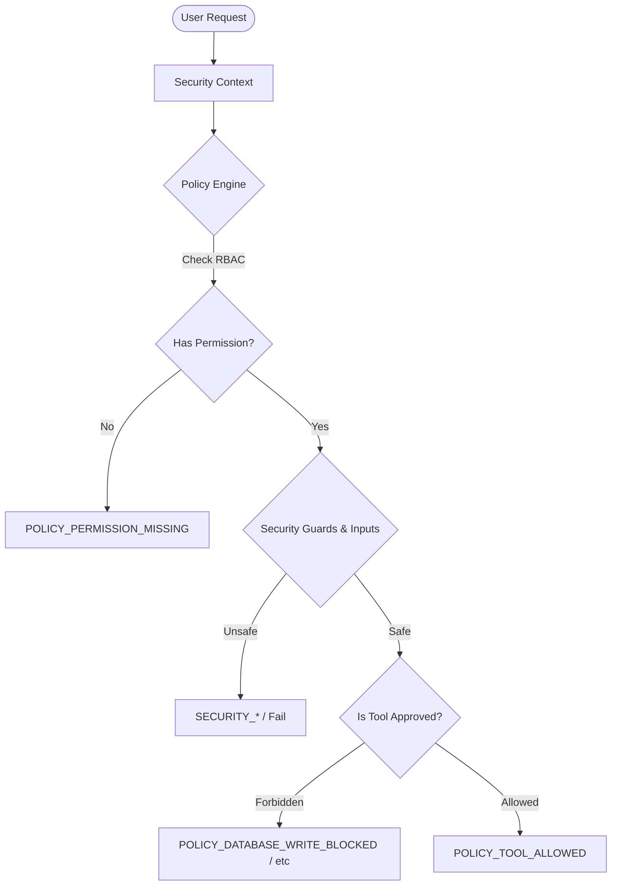

# Implementation Plan — Step 6: Security + Policy Engine + HITL Approval

This document outlines the detailed design and implementation steps for building the deterministic control layer of the **CashFlow Guardian** platform. It provides centralized permission enforcement, input sanitization, prompt-injection defense, sensitive-data redaction, safe-error handling, structured audit logging, and a Human-in-the-Loop (HITL) approval workflow for the watchlist.

---

## User Review Required

> [!IMPORTANT]
> The source DuckDB database (`sme_cashflow_stress.duckdb`) is strictly **read-only**. All writes for the MVP Watchlist approval flow must target `data/demo_actions.json`. We enforce this programmatically in our database connection initialization and via the Policy Engine.

> [!IMPORTANT]
> Proposer self-approval blocks, expired proposal blocks, and `system_agent` approval blocks are hardcoded into the deterministic validation layer. No future LLM behavior can bypass these rules.

---

## Open Questions

None at this time. The requirements are fully detailed.

---

## Proposed Changes

### Component 1: Security schemas and validations

Implement core Pydantic data schemas and sanitization functions to protect tools from unsafe caller arguments or malicious prompt injections.

#### [NEW] [schemas.py](file:///d:/5-Days-AI-Kaggle/Capstone/cashflow_guardian/src/cashflow_guardian/security/schemas.py)
Defines basic security-related schemas:
* `UserPrincipal`: Stores user details, assigned role, and permissions.
* `SecurityContext`: Context attached to every request, identifying caller and metadata.
* `SafeError`: Redacted error container returned to the Agent.
* `RedactionResult`: Wrap recursively redacted fields.
* `InjectionAssessment`: Evaluation result for prompt injection detection.

#### [NEW] [validation.py](file:///d:/5-Days-AI-Kaggle/Capstone/cashflow_guardian/src/cashflow_guardian/security/validation.py)
Implements input sanitization and verification guards:
* Rejects SQL-like patterns in business IDs.
* Rejects path-traversal strings (`..`, `/`, `\\` in IDs).
* Rejects absolute file paths supplied by callers (e.g. drive letters or root paths).
* Rejects serialized Python objects (e.g. pickle strings).
* Rejects `NaN` and `infinity` in floating-point inputs.
* Enforces `YYYY-MM` month formats and bounds ($\le$ 2025-12).

#### [NEW] [sanitization.py](file:///d:/5-Days-AI-Kaggle/Capstone/cashflow_guardian/src/cashflow_guardian/security/sanitization.py)
Implements string cleansing helpers:
* `sanitize_memo`: Cleanses transaction memo strings by stripping instruction keywords (`ignore`, `system prompt`, `override`, `say`, `instruction`) or truncating to a maximum of 30 characters.
* `wrap_in_xml_tags`: Encapsulates untrusted memos in XML tags (`<memo>...</memo>`).

#### [NEW] [redaction.py](file:///d:/5-Days-AI-Kaggle/Capstone/cashflow_guardian/src/cashflow_guardian/security/redaction.py)
Implements recursive sensitive-data redaction:
* Matches and masks emails, phone numbers, account numbers, API keys/tokens, connection strings, database credentials, local absolute paths, and stack trace patterns.
* Works recursively for strings, lists, dicts, Pydantic models, and exceptions.

#### [NEW] [prompt_injection.py](file:///d:/5-Days-AI-Kaggle/Capstone/cashflow_guardian/src/cashflow_guardian/security/prompt_injection.py)
Implements `assess_prompt_injection(text)`:
* Performs deterministic keyword scanning for instructions to bypass security controls, reveal system prompts, execute SQL, or auto-approve watchlist proposals.

#### [NEW] [safe_errors.py](file:///d:/5-Days-AI-Kaggle/Capstone/cashflow_guardian/src/cashflow_guardian/security/safe_errors.py)
Implements translation of raw system exceptions to Pydantic-compliant `SafeError` objects:
* Hides internal trackbacks, local directory structures, database connection details, and model internal representations.

#### [NEW] [guards.py](file:///d:/5-Days-AI-Kaggle/Capstone/cashflow_guardian/src/cashflow_guardian/security/guards.py)
Orchestrates prompt injection checks and input validations as a single gate.

---

### Component 2: Central Policy Engine and RBAC Model

Implement deterministic RBAC checks and evaluate whether a requested tool call is authorized.

#### [NEW] [schemas.py](file:///d:/5-Days-AI-Kaggle/Capstone/cashflow_guardian/src/cashflow_guardian/policy/schemas.py)
Defines:
* `ToolExecutionRequest`
* `ToolExecutionDecision`
* `WatchlistProposal`
* `ApprovalDecision`
* `WatchlistActionRecord`

#### [NEW] [permissions.py](file:///d:/5-Days-AI-Kaggle/Capstone/cashflow_guardian/src/cashflow_guardian/policy/permissions.py)
Contains the Role-Permission Matrix:
* **Roles**: `analyst`, `relationship_manager`, `risk_manager`, `administrator`, `system_agent`
* **Permissions**:
  * `portfolio.read`, `business.read`, `risk.read`, `benchmark.read`
  * `scenario.run`, `intervention.draft`, `watchlist.propose`
  * `watchlist.approve`, `watchlist.reject`, `audit.read`



#### [NEW] [rules.py](file:///d:/5-Days-AI-Kaggle/Capstone/cashflow_guardian/src/cashflow_guardian/policy/rules.py)
Defines tool-to-permission mappings and forbidden tool checks:
* Forbidden actions list: `database_write`, `execute_sql`, `send_email`, `change_credit_limit`, `approve_loan`, `reject_loan`, `freeze_account`, `execute_collections`.
* Raises errors if forbidden actions are requested.

#### [NEW] [engine.py](file:///d:/5-Days-AI-Kaggle/Capstone/cashflow_guardian/src/cashflow_guardian/policy/engine.py)
Implements:
`evaluate_tool_request(security_context, tool_name, tool_arguments) -> ToolExecutionDecision`

#### [NEW] [approval.py](file:///d:/5-Days-AI-Kaggle/Capstone/cashflow_guardian/src/cashflow_guardian/policy/approval.py)
Implements proposal state machine validation and decision logic:
* Validates state transitions:
  * `pending` $\rightarrow$ `approved` | `rejected` | `expired` | `cancelled`
  * Blocks any other transitions (e.g. `approved` $\rightarrow$ `rejected`).
* Enforces approval constraints (role permission, self-approval prevention, expiration checking, empty rationale blockage, future-data usage check).

#### [NEW] [watchlist.py](file:///d:/5-Days-AI-Kaggle/Capstone/cashflow_guardian/src/cashflow_guardian/policy/watchlist.py)
Provides public functions to propose, review, and query the watchlist:
* `create_watchlist_proposal(...)`
* `review_watchlist_proposal(...)`
* `list_pending_watchlist_proposals(...)`
* `get_watchlist_action_history(...)`

#### [NEW] [audit.py](file:///d:/5-Days-AI-Kaggle/Capstone/cashflow_guardian/src/cashflow_guardian/policy/audit.py)
Handles logging of policy decisions to the audit engine.

---

### Component 3: Observability, Trace Store, and Audit Logger

Provide local structured audit logging and tracing functions.

#### [NEW] [schemas.py](file:///d:/5-Days-AI-Kaggle/Capstone/cashflow_guardian/src/cashflow_guardian/observability/schemas.py)
Defines:
* `AuditEvent`
* `TraceStep`
* `TraceRecord`

#### [NEW] [logger.py](file:///d:/5-Days-AI-Kaggle/Capstone/cashflow_guardian/src/cashflow_guardian/observability/logger.py)
Implements structured logging with redaction filters.

#### [NEW] [audit_log.py](file:///d:/5-Days-AI-Kaggle/Capstone/cashflow_guardian/src/cashflow_guardian/observability/audit_log.py)
Appends events to:
* `artifacts/audit/policy_events.jsonl`
* `artifacts/audit/hitl_events.jsonl`
* `artifacts/audit/security_events.jsonl`
Uses standard thread-safe locks.

#### [NEW] [trace_store.py](file:///d:/5-Days-AI-Kaggle/Capstone/cashflow_guardian/src/cashflow_guardian/observability/trace_store.py)
Maintains agent request traces:
* Tracks lifecycle states from request received, validation, policy evaluation, tool start/success/failure, up to response generation.

---

### Component 4: Tool execution integration

Integrate the policy engine and security validation into the tool execution path.

#### [MODIFY] [registry.py](file:///d:/5-Days-AI-Kaggle/Capstone/cashflow_guardian/src/cashflow_guardian/tools/registry.py)
Integrates policy engine and safe execution:
* Adds `execute_tool_with_policy(...)` as the single execution path.
* Wraps callable execution in exception handler blocks converting raw tracebacks to `SafeError`.

#### [MODIFY] [__init__.py](file:///d:/5-Days-AI-Kaggle/Capstone/cashflow_guardian/src/cashflow_guardian/tools/__init__.py)
Exports `execute_tool_with_policy`.

---

### Component 5: Persistence configuration

#### [NEW] [demo_actions.json](file:///d:/5-Days-AI-Kaggle/Capstone/cashflow_guardian/data/demo_actions.json)
Local persistent store for HITL actions.
Schema structure:
```json
{
  "schema_version": "1.0",
  "updated_at": "2026-07-03T18:16:34Z",
  "proposals": [],
  "decisions": [],
  "watchlist": []
}
```

---

## Verification Plan

### Automated Tests
Run the entire unit and integration test suite:
```bash
python -m pytest tests/unit/policy -q
python -m pytest tests/unit/security -q
python -m pytest tests/unit/observability -q
python -m pytest tests/integration/test_policy_tool_enforcement.py -q
python -m pytest tests/integration/test_hitl_watchlist_workflow.py -q
python -m pytest tests/integration/test_security_boundaries.py -q
python -m pytest tests/integration/test_audit_trace_workflow.py -q
```

### Manual Verification
Execute and verify the three validation scripts:
1. `python scripts/validate_policy_engine.py` (Verify policy constraints and RBAC)
2. `python scripts/validate_security_controls.py` (Verify prompt injection, validation, and redaction)
3. `python scripts/validate_hitl_workflow.py` (Verify full proposal creation, rejection of self-approval, successful approval, watchlist updates, and source DB immutability)

Verify the immutability of the source database `sme_cashflow_stress.duckdb` by calculating row counts and file sizes before and after executing the validation scripts.
